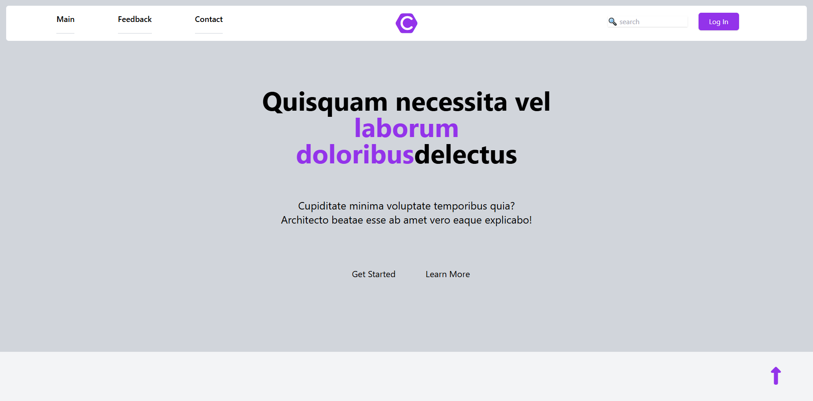
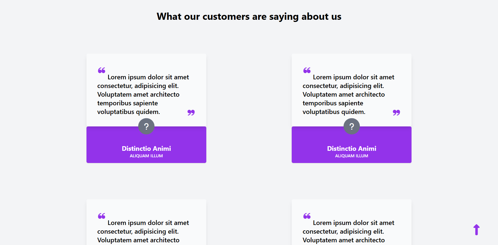
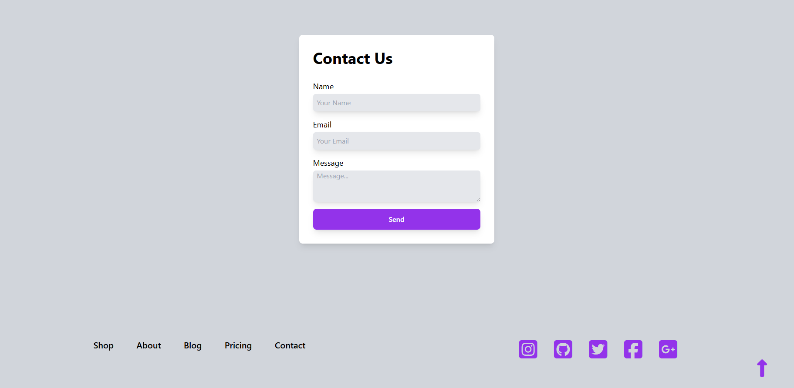

# Genel Landing Page Örneği (Tailwind CSS & Font Awesome) 🚀

Bu proje, modern web tasarım trendlerine uygun, **Tailwind CSS** ve **Font Awesome** kütüphaneleri kullanılarak geliştirilmiş duyarlı bir "Landing Page" (Açılış Sayfası) örneğidir. Kullanıcı etkileşimini ve bilgi sunumunu ön planda tutan temiz bir arayüze sahiptir.

## Canlı Demoya Ulaşmak İçin

📌 https://canbozv5.github.io/review-page 📌

## Web Sitesinin Ufak Bir Önizlemesi

## İçindekiler

- [Genel Bakış](#genel-bakış)
- [Özellikler](#özellikler)
- [Kullanılan Teknolojiler](#kullanılan-teknolojiler)
- [Sayfalar ve Bölümler](#sayfalar-ve-bölümler)
- [Katkıda Bulunma](#katkıda-bulunma)
- [İletişim](#i̇letişim)

---

## Genel Bakış

Bu HTML projesi, kullanıcıları belirli bir ürün, hizmet veya bilgiye yönlendirmek için tasarlanmış tek sayfalık bir web uygulamasıdır. Tailwind CSS'in "utility-first" yaklaşımı sayesinde hızlıca stil verilebilirlik ve responsive tasarım kolaylığı sağlanmıştır. Sayfa, ana giriş ekranı, müşteri geri bildirimleri (feedback) ve iletişim formu gibi temel bölümleri içerir.

## Özellikler

- **Duyarlı Tasarım:** Tailwind CSS ile tüm cihaz ve ekran boyutlarına uyumlu bir görünüm sunar.
- **Modern Arayüz:** Temiz, minimalist ve kullanıcı dostu bir tasarıma sahiptir.
- **Etkileşimli Navigasyon:** Üst menüde sayfa içi bağlantılar (Main, Feedback, Contact) bulunur ve hover efektleriyle kullanıcı deneyimi zenginleştirilmiştir.
- **Arama Çubuğu ve Giriş Butonu:** Kullanışlı bir arama alanı ve "Log In" butonu içerir.
- **Marka İkonu:** Hexagon içinde "C" harfi ile tasarlanmış özelleştirilmiş bir marka ikonu bulunur.
- **Müşteri Geri Bildirimleri:** Müşteri yorumlarını sergileyen kart tabanlı bir bölüm ("What our customers are saying about us").
- **İletişim Formu:** Kullanıcıların mesaj gönderebileceği, ad, e-posta ve mesaj alanlarını içeren basit bir form.
- **Geri Dönüş Butonu:** Sayfanın en altına konumlandırılmış, sayfanın başına hızlıca dönmeyi sağlayan bir "Yukarı Çık" butonu.
- **Sosyal Medya Bağlantıları:** Alt kısımda Instagram, GitHub, Twitter, Facebook ve Google Plus için ikon bağlantıları yer alır.

## Kullanılan Teknolojiler

- **HTML5:** Sayfa yapısının iskeletini oluşturmak için.
- **Tailwind CSS (CDN):** Hızlı ve esnek stil tanımlamaları için "utility-first" CSS framework'ü.
- **Font Awesome 6.5.1 (CDN):** İkon kullanımı için.

## Sayfa Yapısı

Proje tek bir HTML sayfası üzerinden çalışır ve ana bileşenleri şunlardır:

- **Header (`<header>`):** Navigasyon menüsü, dinamik bir marka ikonu ve arama çubuğu ile "Log In" butonunu içerir.
- **Ana Bölüm (`<main id="main">`):** Sayfanın ana başlığını ve kısa açıklamasını barındırır. "Get Started" ve "Learn More" gibi çağrı butonları bulunur.
- **Geri Bildirim Bölümü (`<main id="feedback">`):** Müşteri yorumlarının yer aldığı kart yapılı bir alandır. Her yorum kartında alıntı işaretleri ve altında bilgi işareti bulunur.
- **İletişim Bölümü (`<section id="contact">`):** Kullanıcıların ad, e-posta ve mesaj girerek iletişim kurabileceği bir form içerir.
- **Footer (`<footer>`):** Alt menü bağlantıları (Shop, About, Blog, Pricing, Contact) ve sosyal medya ikon bağlantılarını barındırır.
- **Yukarı Çık Butonu (`
`):** Sayfanın alt sağ köşesinde sabit duran ve sayfanın en üstüne hızlı dönüş sağlayan bir ikondur.

## Katkıda Bulunma

Projeye katkıda bulunmak isterseniz, lütfen aşağıdaki adımları izleyin:

1.  Bu depoyu (repository) **fork edin**.
2.  Yeni bir dal (branch) oluşturun: `git checkout -b feature/AmazingFeature`
3.  Değişikliklerinizi yapın ve commit edin: `git commit -m 'Add some AmazingFeature'`
4.  Dalı push edin: `git push origin feature/AmazingFeature`
5.  Bir **Pull Request (PR)** oluşturun.

## İletişim

Can BOZ - [LinkedIn Profilin](https://www.linkedin.com/in/emrecanboz)
